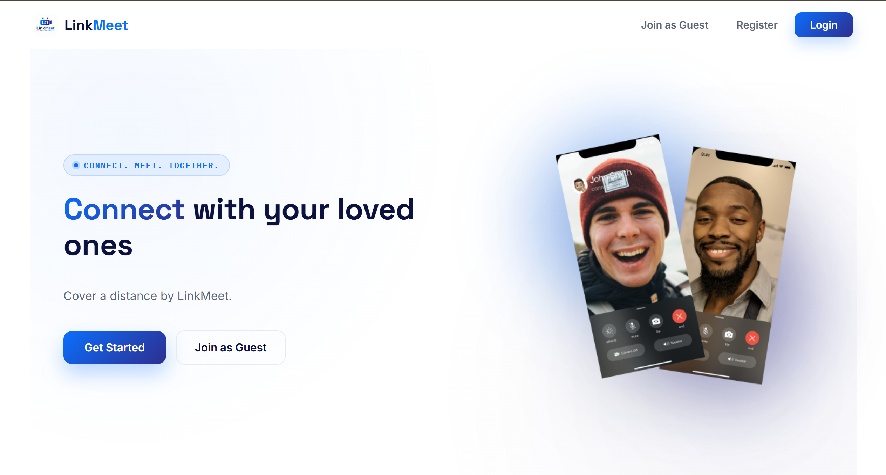
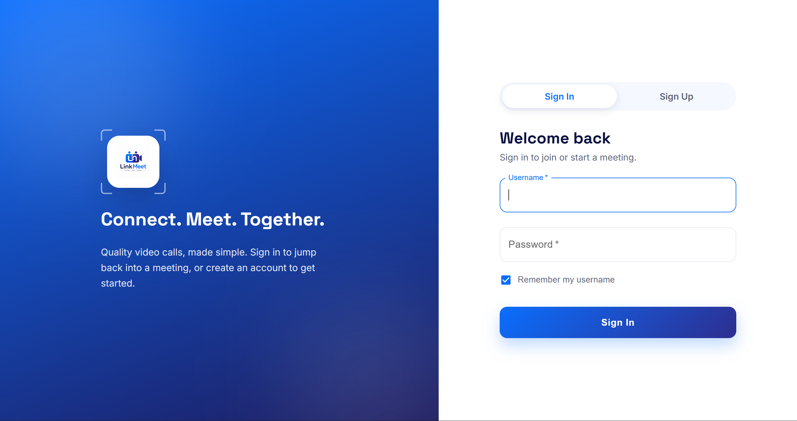
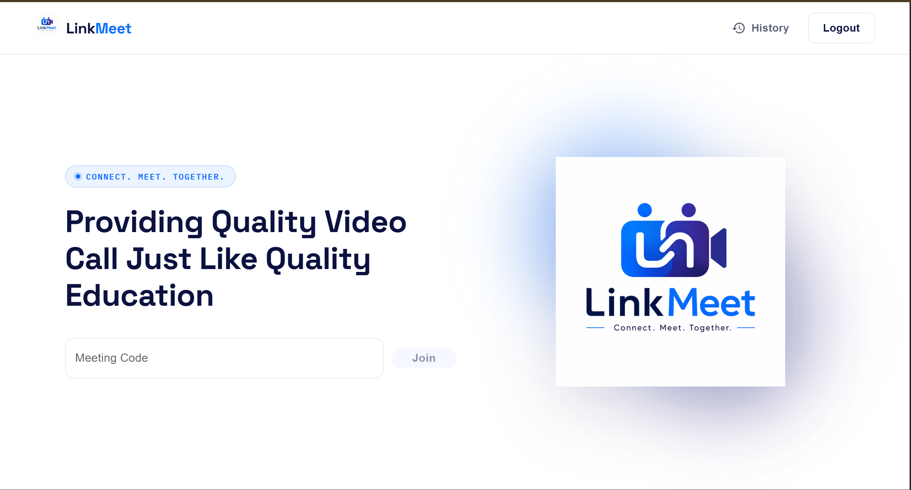
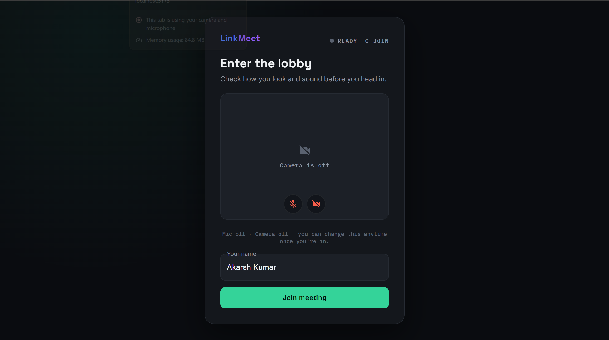
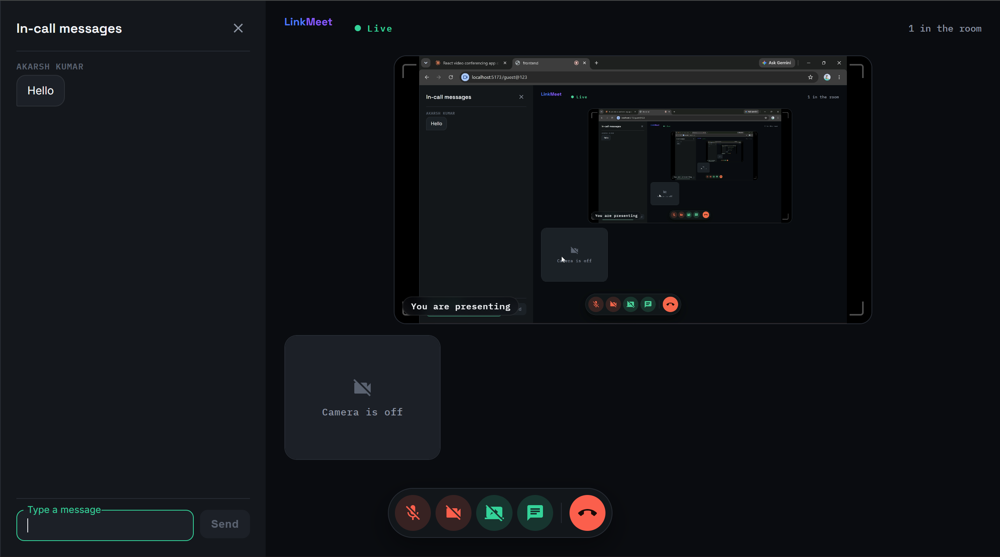
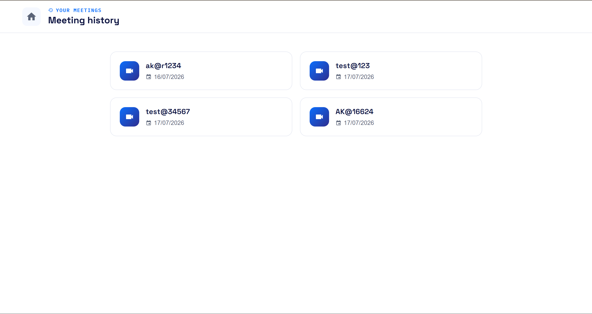

# LinkMeet 🎥

A modern **real-time video conferencing platform** built with the **MERN Stack**, **WebRTC**, and **Socket.io**. LinkMeet allows users to create secure meeting rooms, join video calls instantly, chat with participants, share their screen, and manage meeting history all from their browser without installing additional software.

> Built as a full-stack project to demonstrate real-time communication using WebRTC and Socket.io.

## 🌐 Live Demo

**Frontend:** https://link-meet.netlify.app/

**Backend API:** https://linkmeetbackend-mygx.onrender.com

---

# ✨ Features

- 🔐 Secure User Authentication
- 👥 Create & Join Meeting Rooms
- 📹 HD Video Calling
- 🎤 Audio Controls (Mute/Unmute)
- 📺 Screen Sharing
- 💬 Real-time Chat
- ⚡ Socket.io Signalling
- 🕒 Meeting History
- 👤 Waiting Lobby before joining
- 📱 Responsive User Interface

---

# 🛠 Tech Stack

## Frontend

- React.js (Vite)
- Material UI (MUI)
- React Router DOM
- Axios
- Socket.io Client
- CSS3

## Backend

- Node.js
- Express.js
- MongoDB
- Mongoose
- Socket.io
- Token-based Authentication (bcrypt + server-verified session tokens)

## Real-Time Communication

- WebRTC
- Socket.io

## Deployment

- Frontend – Netlify
- Backend – Render
- Database – MongoDB Atlas

---

# 🏗 System Architecture

```
                +----------------+
                |    Frontend    |
                | React + Vite   |
                +-------+--------+
                        |
                 HTTP / WebSocket
                        |
                        ▼
              +-------------------+
              | Express + Node.js |
              |   Socket.io API   |
              +---------+---------+
                        |
          +-------------+-------------+
          |                           |
          ▼                           ▼
     MongoDB Atlas               WebRTC Signalling
                                 (Peer Connection)
```

---

# 📂 Project Structure

```
LinkMeet/
│
├── Backend/
│   ├── src/
│   │   ├── controllers/
│   │   ├── models/
│   │   ├── routes/
│   │   └── app.js
│   ├── package.json
│   └── .env
│
├── frontend/
│   ├── public/
│   ├── src/
│   │   ├── contexts/
│   │   ├── pages/
│   │   ├── styles/
│   │   ├── utils/
│   │   ├── App.jsx
│   │   ├── App.css
│   │   ├── environment.js
│   │   ├── index.css
│   │   └── main.jsx
│   ├── index.html
│   └── package.json
│
├── Screenshots/
└── README.md
```

---

# 🚀 Getting Started

## Prerequisites

- Node.js (v18 or later)
- npm
- MongoDB Atlas or Local MongoDB

---

## Clone Repository

```bash
git clone https://github.com/Akarsh-Coding/LinkMeet.git

cd LinkMeet
```

---

## Backend Setup

```bash
cd Backend

npm install
```

Create a `.env` file inside the Backend folder.

Example:

```env
PORT=8000

MONGO_URI=your_mongodb_connection
```

Run the backend server:

```bash
npm run dev
```

---

## Frontend Setup

```bash
cd frontend

npm install
```

Run the frontend:

```bash
npm run dev
```

The application will be available at

```
http://localhost:5173
```

---

# 📸 Application Screenshots

## Landing Page



---

## Authentication



---

## Home Dashboard



---

## Waiting Lobby



---

## Meeting Room



---

## Meeting History



---

# 🔄 Application Workflow

```
User Registration/Login
          │
          ▼
      Home Dashboard
          │
          ▼
     Join Meeting
          │
          ▼
    Waiting Lobby
          │
          ▼
    Video Conference
      │        │
      │        ├── Chat
      │
      ├── Screen Share
      │
      ├── Audio/Video Controls
      │
      ▼
 Leave Meeting
      │
      ▼
Meeting Saved in History
```

---

# 🔒 Authentication

- Passwords hashed with bcrypt before storage
- Random session token generated at login and stored on the user document
- Token verified via database lookup on protected requests
- Protected Routes
- Secure Login & Registration

---

# Future Improvements

- Group Meetings (Multiple Participants)
- Meeting Recording
- Virtual Background
- Raise Hand Feature
- File Sharing
- Live Captions
- Meeting Scheduling

---

# 🤝 Contributing

Contributions are always welcome.

1. Fork the repository

2. Create a feature branch

```bash
git checkout -b feature-name
```

3. Commit your changes

```bash
git commit -m "Added new feature"
```

4. Push your branch

```bash
git push origin feature-name
```

5. Open a Pull Request

---

# 👨‍💻 Author

**Akarsh Kumar**

GitHub: https://github.com/Akarsh-Coding

LinkedIn: www.linkedin.com/in/akarsh-kumar-471029323

---

⭐ If you found this project helpful, consider giving it a star on GitHub!
